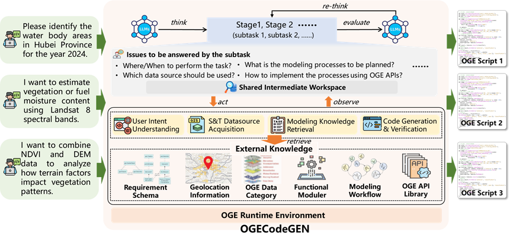
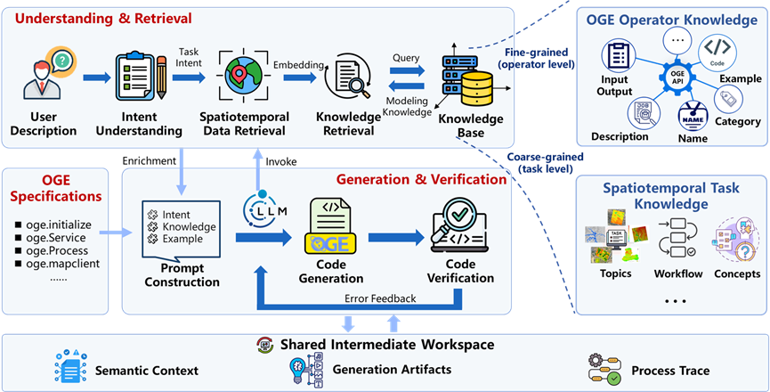

# 🌍 OGECodeGEN

**OGECodeGEN** is a domain knowledge-grounded geospatial code generation framework for the **Open Geospatial Engine (OGE)** platform. It converts natural-language geospatial analysis requests into OGE Python code by coordinating intent understanding, spatiotemporal datasource acquisition, modeling knowledge retrieval, code generation, platform-level verification, and ReAct-guided feedback correction.

The project is designed for research on platform-constrained geospatial code generation, remote-sensing workflow automation, and LLM-assisted programming for less-documented or customized geospatial computing platforms.

---

## 📌 Overview

OGECodeGEN addresses a practical challenge in geospatial programming: users often describe an analytical goal in natural language, while the OGE platform requires precise API calls, valid data products, correct operator parameters, and a coherent computational workflow.

The framework follows a five-component pipeline coordinated by a ReAct-style feedback mechanism:

1. **Intent Understanding** extracts structured task semantics from the user request.
2. **Spatiotemporal Datasource Acquisition** selects suitable OGE data products and summarizes data access context.
3. **Modeling Knowledge Retrieval** retrieves task-level and operator-level knowledge to support workflow planning and operator selection.
4. **Code Generation** produces OGE Python code using platform syntax rules and retrieved context.
5. **Code Verification** checks generated code through platform-oriented validation and DAG-based structural checking.

When verification fails, the ReAct-style feedback mechanism treats the verification result as an observation, reasons about the failure causes, and triggers actions such as data or knowledge re-retrieval and targeted code revision via the Repair mode.


> The overall architecture of the OGECodeGEN


> Component coordination in OGECodeGEN

---

## 🎬 Demo Examples

The following GIFs provide lightweight previews of OGECodeGEN in typical geospatial code generation scenarios. Full MP4 demo videos with the same filenames are available in the `demo_video/` directory.

### Example 1: Land Surface Temperature Mapping

This example demonstrates how OGECodeGEN generates OGE code for examining land surface thermal conditions in Wuhan using a Landsat 9 image from early March 2023. The task includes extracting the main land surface temperature layer, generating an intuitive temperature distribution map, and displaying relatively hotter and cooler areas.


Full video: [`demo_video/Example_land_surface_temperature.mp4`](demo_video/Example_land_surface_temperature.mp4)

### Example 2: Road and Transportation Facility Extraction from Vector Data

This example shows a vector-based spatial extraction task using user-uploaded road and transportation facility datasets for Wuhan in 2023. OGECodeGEN generates code to construct a specified analysis area, extract roads and transportation facilities within the area, and visualize the analysis area together with the extracted vector features.


Full video: [`demo_video/Example_road_facility_extraction.mp4`](demo_video/Example_road_facility_extraction.mp4)

### Example 3: Urban Construction Land Mapping

This example demonstrates urban construction land mapping in Wuhan using a Landsat 8 image from early October 2015. The task combines shortwave infrared, red, near-infrared, and blue bands to calculate a built-up area enhancement index, highlighting potential built-up areas and impervious surfaces.


Full video: [`demo_video/Example_urban_distribution.mp4`](demo_video/Example_urban_distribution.mp4)
## 📂 Repository Structure

```text
OGECodeGEN/
├── data_json/              # Benchmark data, task/operator knowledge, and OGE product metadata
├── prompts/                # Prompt templates for intent, retrieval, codegen, ReAct, and benchmarks
├── script/                 # Scripts for API preprocessing and Milvus knowledge-base upload
├── src/
│   ├── core/               # Shared pipeline state and core data structures
│   ├── modules/            # Intent, retrieval, code generation, and verification modules
│   ├── react_modules/      # ReAct decision-making and repair controller
│   ├── tools/              # Config, model clients, Milvus store, prompt loader, and DAG utilities
│   ├── paper_benchmarks/   # Benchmark running, evaluation, and correctness judging scripts
│   └── service.py          # FastAPI service entry with SSE support
├── images/                 # Figures and GIF previews used in README and documentation
├── demo_video/             # Full MP4 demo videos corresponding to the GIF previews
├── config.template.yaml    # Main configuration template
├── requirements.txt        # Python dependencies
├── oge-2.1.3-py3-none-any.whl
└── README.md
```

---

## 🧪 Benchmark Dataset

The evaluation benchmark contains **147 OGE task samples**. Each sample includes a user request, task category, data reference information, reference OGE code, and a reference DAG extracted from the code.

The benchmark covers five representative categories of geospatial computing tasks and three difficulty levels.

| Task Category               |   Easy | Moderate |   Hard |   Total |
| --------------------------- | -----: |---------:| -----: | ------: |
| Image Processing            |     10 |       11 |      0 |      21 |
| Quantitative Remote Sensing |     24 |       17 |     10 |      51 |
| Spatiotemporal Statistics   |     11 |        9 |      3 |      23 |
| Terrain Analysis            |     10 |        6 |     10 |      26 |
| Spatial Analysis            |      6 |        7 |     13 |      26 |
| **Total**                   | **61** |   **50** | **36** | **147** |

The difficulty level considers the number of core analytical steps, the number of task objects, workflow complexity, and parameter-constraint complexity.

---

## 📊 Evaluation Metrics

The benchmark uses both code-level and workflow-level metrics:

| Metric | Description |
| --- | --- |
| **Executability** | Verifiable executability based on OGE platform-oriented validation. It is not a full runtime execution success rate. |
| **NMR** | Node Matching Rate between generated and reference DAGs. |
| **EMR** | Edge Matching Rate between generated and reference DAGs. |
| **TSim** | Topological Similarity between generated and reference workflows. |
| **Semantic Correctness** | Task-level semantic quality judged by task fulfillment, data usage, parameter validity, output quality, and result plausibility. |
| **debugging@k** | Verifiable executability after at most `k` debugging iterations; in the paper setting, debugging@3 equals final Executability. |

---

## 📈 Main Results

OGECodeGEN is compared with three baselines or ablations:

- **OURS**: the complete OGECodeGEN framework.
- **woIU**: without the explicit intent-understanding module.
- **woKR**: without knowledge retrieval.
- **IOP**: input-output prompting using OGE syntax and I/O specifications only.

Overall, the full framework consistently outperforms **IOP** and **woKR** in verifiable executability, structural consistency, and semantic correctness. The intent-understanding module is most useful for tasks with richer constraints and longer processing chains, while simple tasks may already be sufficiently specified by the original query.

Selected overall results for a subset of evaluated models are shown below. The complete results across all models, settings, and difficulty levels are provided in the paper appendix.

| Model         | Setting |     Exec. |       NMR |       EMR |      TSim |     Corr. |     Dbg@0 |     Dbg@1 |     Dbg@2 |
| ------------- | ------- | --------: | --------: | --------: | --------: | --------: | --------: | --------: | --------: |
| Qwen2.5-14B   | OURS    | **0.741** | **0.481** |     0.230 |     0.247 | **6.171** | **0.667** | **0.721** | **0.735** |
|               | woIU    |     0.694 |     0.475 | **0.237** | **0.250** |     6.043 |     0.612 |     0.667 |     0.694 |
|               | woKR    |     0.456 |     0.381 |     0.113 |     0.139 |     4.640 |     0.367 |     0.415 |     0.449 |
|               | IOP     |     0.272 |     0.369 |     0.092 |     0.125 |     4.297 |     0.272 |     0.272 |     0.272 |
| Gemma-4-31B   | OURS    |     0.993 | **0.562** | **0.348** | **0.353** | **7.727** | **0.952** | **0.993** |     0.993 |
|               | woIU    | **1.000** |     0.559 |     0.343 |     0.348 |     7.674 |     0.925 | **0.993** | **1.000** |
|               | woKR    |     0.830 |     0.349 |     0.126 |     0.136 |     5.274 |     0.667 |     0.782 |     0.810 |
|               | IOP     |     0.551 |     0.396 |     0.153 |     0.174 |     6.182 |     0.456 |     0.531 |     0.551 |
| DeepSeek-V3.2 | OURS    | **0.952** | **0.530** |     0.295 | **0.305** |     7.459 | **0.857** | **0.905** | **0.932** |
|               | woIU    |     0.925 |     0.522 | **0.295** |     0.304 | **7.532** |     0.796 |     0.891 |     0.905 |
|               | woKR    |     0.585 |     0.413 |     0.167 |     0.190 |     6.162 |     0.408 |     0.476 |     0.537 |
|               | IOP     |     0.367 |     0.393 |     0.142 |     0.168 |     5.528 |     0.333 |     0.361 |     0.367 |
---

## 🚀 Quick Start

### 1. Environment Setup

Install Python dependencies and the OGE SDK wheel.

```bash
pip install -r requirements.txt
pip install oge-2.1.3-py3-none-any.whl
```

Create the main configuration file.

```bash
cp config.template.yaml config.yaml
```

Edit `config.yaml` and fill in the required LLM, embedding, Milvus, retrieval, controller, and AMap settings.

For paper experiments, also prepare the configuration files under `src/paper_benchmarks/configs/`, such as:

```text
config_iop.yaml
config_woIU.yaml
config_woKR.yaml
config_judges.yaml
```

These files can be created from the corresponding `*.template.yaml` files if templates are provided.

### 2. Prepare the Milvus Knowledge Base

Upload operator and task knowledge to Milvus before running retrieval-augmented generation.

```bash
python script/operators_upload2milvus.py
python script/tasks_upload2milvus.py
```

Use `--recreate` only when you want to drop and rebuild the corresponding Milvus collections.

---

## 🌐 SSE Service Mode

The main service mode is provided through FastAPI with server-sent events (SSE). It allows a frontend or plugin to display intermediate results in real time.

Start the service from the project root:

```bash
uvicorn src.service:app --host 0.0.0.0 --port 8000 --reload
```

### Core Endpoints

**Health check**

```http
GET http://localhost:8000/health
```

**Streaming code generation**

```http
POST http://localhost:8000/chat/stream
Content-Type: application/json
```

Example body:

```json
{
  "query": "Use Landsat data to calculate NDVI in Wuhan.",
  "lang": "en",
  "modules": {
    "intent": true,
    "retrieval_data": true,
    "retrieval_knowledge": true,
    "codegen": true,
    "code_verify": true
  }
}
```

Typical SSE event flow:

```text
start -> intent -> retrieval_data -> retrieval_knowledge -> codegen -> code_verify -> done
```

If verification fails, the ReAct repair loop may produce additional events:

```text
react_start -> react_step -> react_verify -> react_done -> done
```

---

## 🧩 Paper Experiment Programs

The paper experiments are located in `src/paper_benchmarks/`. They are used to run the full method, baselines, ablation settings, correctness judging, and result aggregation.

### Main Batch Experiment

Configure the benchmark path, experiment list, output directory, and runners in:

```text
src/paper_benchmarks/experimental.py
```

Then run:

```bash
python -m src.paper_benchmarks.experimental
```

The experiment configurations typically include:

```text
config.yaml                                  # OURS: complete framework
src/paper_benchmarks/configs/config_woIU.yaml # ablation without intent understanding
src/paper_benchmarks/configs/config_woKR.yaml # ablation without knowledge retrieval
src/paper_benchmarks/configs/config_iop.yaml  # input-output prompting baseline
```

### Correctness Judging

```bash
python -m src.paper_benchmarks.correctness_judges_batch
```

The judging configuration is controlled by:

```text
src/paper_benchmarks/configs/config_judges.yaml
```

### Result Evaluation and Summary

```bash
python -m src.paper_benchmarks.evaluate_results_with_difficulty
python -m src.paper_benchmarks.summary_all_results_with_difficulty
```

Benchmark outputs are written to `benchmarks_results/`, including per-case records, experiment indices, structural metrics, correctness judgments, and difficulty-level summaries.

---

## 📦 Notes for Public Release

Before releasing this repository, please check the following items:

- Remove private API keys, Milvus tokens, internal endpoints, and local paths.
- Confirm whether the OGE SDK wheel can be redistributed publicly.
- Replace placeholder figure paths with final images.
- Add a license file if the project is intended for open-source distribution.
- Add citation information after the corresponding paper is available.

---

## 📖 Citation

If you use OGECodeGEN in academic work, please cite the corresponding paper once it is published.

```bibtex
@article{ogecodegen2026,
  title   = {OGECodeGEN: a domain knowledge-grounded framework for automatic geospatial code generation on the Open Geospatial Engine},
  author  = {Wenjie Chen, Jianyuan Liang*, Longgang Xiang, Huayi Wu},
  journal = {Manuscript under review},
  year    = {2026}
}
```

---

## 📬 Contact

For questions, issues, or collaboration, please contact: [chenwenjie_ws@whu.edu.cn](mailto:chenwenjie_ws@whu.edu.cn)